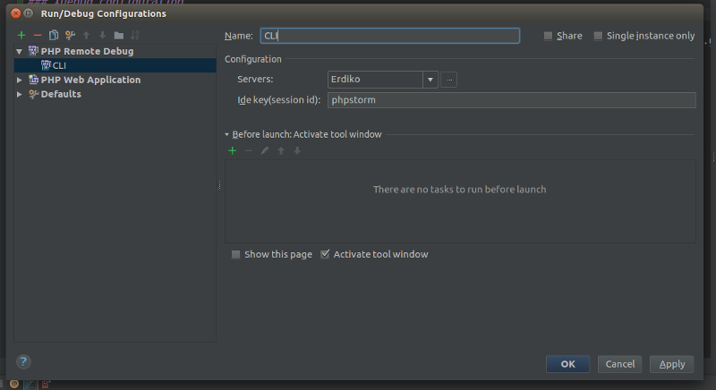

# PHP-FPM w/ Xdebug

Docker image for PHP-FPM that contains Xdebug

To use this image, use the the xdebug tag.  For example:

```
erdiko/php-fpm:latest-xdebug
```

## Xdebug configuration

Once you have a running container using the erdiko/php-fpm:latest-xdebug image you will need to configure your IDE to use Xdebug.  The instructions below are for PHPStorm, but you can use with any IDE or client that supports Xdebug.

Before you start make sure Xdebug is enabled in the PHP container.  Inside the container run:

```
$ php -i | grep xdebug
```

The remote_host value is setup dynamically, so only is necessary set in your IDE the remote folders, (e.g. PHPStorm).

Go to "Run -> Edit Configurations", then select the green plus icon and select "PHP Web Application"


Create a new Server e.g. for user-admin:

IMPORTANT: Check "User Path Mappings"


To use Xdebug on CLI:

Make sure that you have this ENV var into the PHP container:

```
$ echo XDEBUG_CONFIG
```

Then create a new Debug Configuration:

Go to "Run -> Edit Configurations", then select the green plus icon and select "PHP Remote Debug"



Then just you need start the cli debug and execute something into the console, for example a PHPUnitTests
