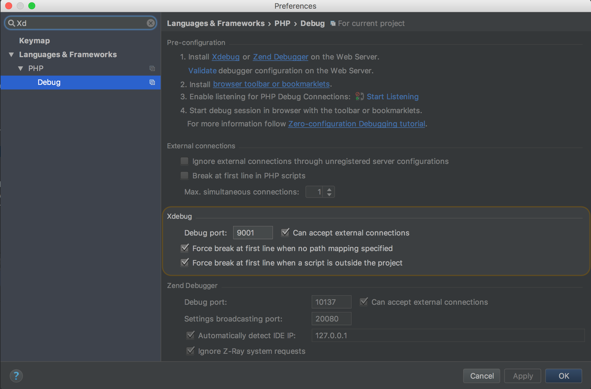
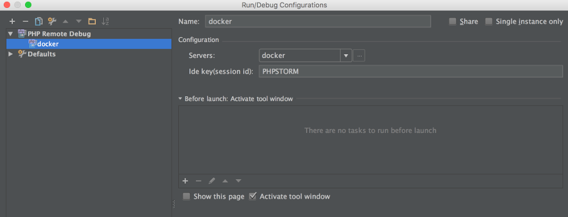
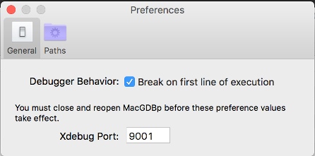
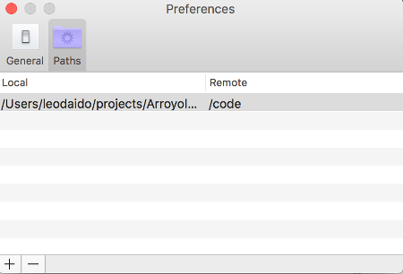

# PHP-FPM w/ Xdebug (for MacOS)

Docker image for PHP-FPM that contains Xdebug

To use this image, use the the xdebug tag.  For example:

```
erdiko/php-fpm:7.1-xdebug-mac
```

## Xdebug configuration

Once you have a running container using the erdiko/php-fpm:7.1-xdebug-mac image you will need to configure your IDE to use Xdebug.

Before you start make sure Xdebug is enabled in the PHP container.  Inside the container run:

```
$ php -i | grep xdebug
```

The remote_host value is setup dynamically, so only is necessary set in your IDE the remote folders and port.

#### In PHPStorm

Start changing in the global debug configuration the port to 9001, go to global preferences (Cmd+,)



Two simple steps to add remote configurations, start going to “Run -> Edit Configurations” menu,
click on green plus sign, and select “PHP Remote Debug”.
In the new Remote, fill the Name field (I will use docker) and in the “Ide Key (session id)” put PHPSTORM.



IMPORTANT: Check "User Path Mappings"


To use Xdebug on CLI:

Make sure that you have this ENV var into the PHP container:

```
$ echo XDEBUG_CONFIG
```

Then just you need start the cli debug and execute something into the console, for example a PHPUnitTests

#### In MacGDBp

Just open the app, go to preferences and change the port to 9001



then set map the path to your local filesystem



finally restart the app and happy debug!
